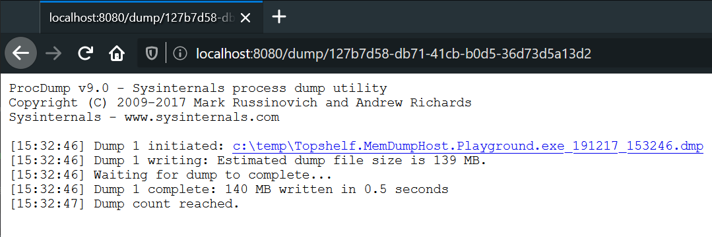

## MemDumpHost [](https://ci.appveyor.com/project/jokokko/memdumphost) [](https://www.nuget.org/packages/MemDumpHost/)
## Topshelf.MemDumpHost [](https://ci.appveyor.com/project/jokokko/memdumphost) [](https://www.nuget.org/packages/Topshelf.MemDumpHost/)

Host HTTP(s) endpoint (Kestrel) for dumping the hosting process memory via [ProcDump](https://docs.microsoft.com/en-us/sysinternals/downloads/procdump). Additionally configurable to randomize the dump URI path, allow dump downloads, download ProcDump etc. Comes with a separate [Topshelf](http://topshelf-project.com/) extension.

**Packages** [MemDumpHost](https://www.nuget.org/packages/MemDumpHost), [Topshelf.MemDumpHost](https://www.nuget.org/packages/Topshelf.MemDumpHost) | **Platforms** .NET Standard 2.0

Example of using MemDumpHost with Topshelf.
```csharp
            var rc = HostFactory.Run(x =>
            {
                x.Service<TownCrier>(s =>
                {
                    s.ConstructUsing(name => new TownCrier());
                    s.WhenStarted(tc => tc.Start());
                    s.WhenStopped(tc => tc.Stop());
                    s.EnableMemDumpEndpoint(c =>
                    {
                        c
                            // Without download or explicit path options, ProcDump is resolved from path env variable.
                            .DownloadProcDump()
                            // Or .WithProcDumpPath(@"c:\temp\procdump.exe")
                            .EnableDumpDownload()
                            .DumpToDirectory(@"c:\temp")
                            .UseUrl("http://*:8080")
                            .RandomGuidInEndpointPath()
                            // Or .RandomGuidInEndpointPath(Guid.Parse("B80B3FFF-EF23-4D7A-A1DF-A93F7A979177"))
                            .DumpUsingArguments(a => a.FullDump().DumpUsingClone().AcceptEula());

                        HostLogger.Get<Program>().Info($"Dump uri guid: {c.PathGuid}");
                    });
                });
                x.RunAsLocalSystem();

                x.SetDescription("Sample Topshelf Host with MemDumpHost enabled");
                x.SetDisplayName("Stuff");
                x.SetServiceName("Stuff");
            });
```



Note: This is a contributor project. Created to support some in-house debugging scenarios.